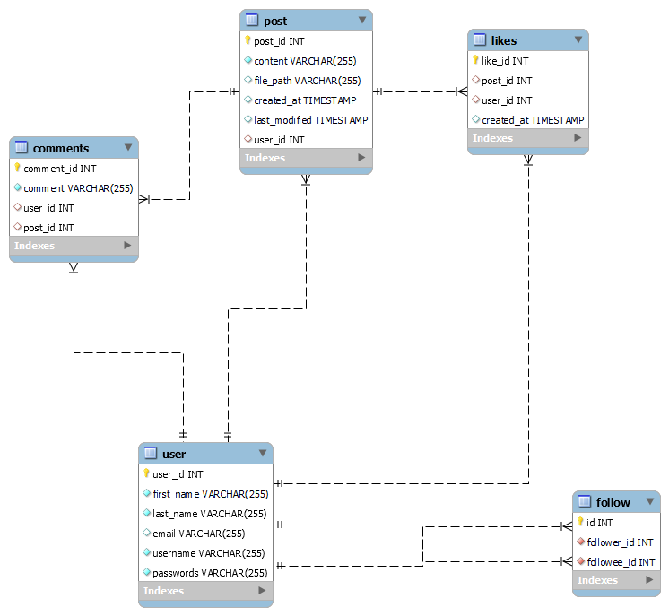

Certainly! Here’s a sample README for your GitHub repository, detailing the endpoints and benefits of your social media application.

---

# Social Media Application

Welcome to the Social Media Application! This application provides a platform for users to interact through posts, likes, comments, and follows. Below you will find detailed information about the available endpoints and the benefits of using our API.

## Table of Contents
- [Introduction](#introduction)
-  [Database Schema](#database-schema)
- [Endpoints](#endpoints)
  - [User Authentication](#user-authentication)
  - [User Management](#user-management)
  - [Post Management](#post-management)
  - [Follow Management](#follow-management)
  - [Like Management](#like-management)
  - [Comment Management](#comment-management)
- [Benefits](#benefits)

## Introduction

This social media application is built using Spring Boot and offers a range of functionalities, including user registration, authentication, post creation, liking posts, commenting on posts, and following other users. It is designed to provide a seamless and user-friendly experience for interacting with others on the platform.

## Database Schema
This section describes the database schema for the social media application. The diagram below illustrates the relationships between the tables in the database.

## Endpoints

### User Authentication

#### Register a new user
- **Endpoint:** `POST /api/user/register`
- **Description:** Registers a new user in the system.
- **Request Body:** `UserDto`
- **Response:** Success or error message.

#### Login
- **Endpoint:** `POST /api/user/login`
- **Description:** Authenticates a user and creates a session.
- **Request Body:** `LoginDto`
- **Response:** Success or error message.

#### Logout
- **Endpoint:** `POST /api/user/logout`
- **Description:** Logs out the current user.
- **Response:** Success message.

### User Management

#### Follow a user
- **Endpoint:** `POST /api/social/user/follow/{followeeId}`
- **Description:** Follows a user.
- **Response:** Success message or error message.

#### Unfollow a user
- **Endpoint:** `DELETE /api/social/user/unfollow/{followeeId}`
- **Description:** Unfollows a user.
- **Response:** Success message or error message.

#### Get followers
- **Endpoint:** `GET /api/social/user/followers`
- **Description:** Retrieves a list of followers.
- **Response:** List of followers.

#### Get users followed by the authenticated user
- **Endpoint:** `GET /api/social/user/usersIfollow`
- **Description:** Retrieves a list of users followed by the authenticated user.
- **Response:** List of followees.

### Post Management

#### Create a new post
- **Endpoint:** `POST /api/social/user/newPost`
- **Description:** Creates a new text post.
- **Request Body:** `NewPostDTO`
- **Response:** Success message and post content.

#### Create a new post with media
- **Endpoint:** `POST /api/social/user/newPostMedia`
- **Description:** Creates a new post with media content.
- **Request Params:** `content`, `file` (MultipartFile)
- **Response:** Success message and post content.

#### Get feed
- **Endpoint:** `GET /api/social/user/feed`
- **Description:** Retrieves the feed for the authenticated user.
- **Response:** List of posts from followed users.

#### Get user posts
- **Endpoint:** `GET /api/social/user/posts`
- **Description:** Retrieves all posts made by the authenticated user.
- **Response:** List of user's posts.

#### Delete a post
- **Endpoint:** `DELETE /api/social/user/post/{postId}`
- **Description:** Deletes a post.
- **Response:** Success message.

#### Update a post
- **Endpoint:** `PUT /api/social/user/updatePost`
- **Description:** Updates a post.
- **Request Body:** `PostDto`
- **Response:** Updated post content.

### Like Management

#### Like a post
- **Endpoint:** `POST /api/social/user/like/post/{postId}`
- **Description:** Likes a post.
- **Response:** Success message and post content.

#### Unlike a post
- **Endpoint:** `DELETE /api/social/user/unlikePost/{postId}`
- **Description:** Unlikes a post.
- **Response:** Success message.

### Comment Management

#### Comment on a post
- **Endpoint:** `POST /api/social/user/comment/post/{postId}`
- **Description:** Adds a comment to a post.
- **Request Body:** `CommentRequest`
- **Response:** Success message, comment, and post content.

#### Delete a comment
- **Endpoint:** `DELETE /api/social/user/comment/post/{postId}`
- **Description:** Deletes a comment.
- **Response:** Success message.

## Benefits

1. **User Engagement:** The application enables users to engage with each other through posts, likes, comments, and follows, fostering a sense of community.
2. **Real-Time Interaction:** Users can receive real-time updates from those they follow, ensuring they stay connected and up-to-date with the latest activities.
3. **Media Sharing:** Users can share multimedia content, enhancing their interactions and making the platform more dynamic and engaging.
4. **Security:** The application utilizes Spring Security to ensure secure authentication and authorization processes, protecting user data and interactions.
5. **Scalability:** Built with Spring Boot, the application is designed to scale efficiently, accommodating a growing number of users and interactions.

 
---

 
